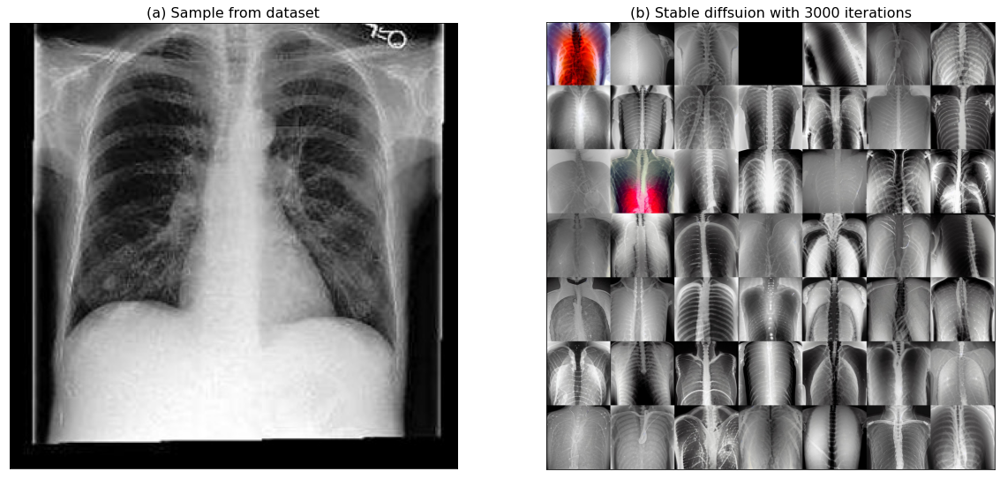
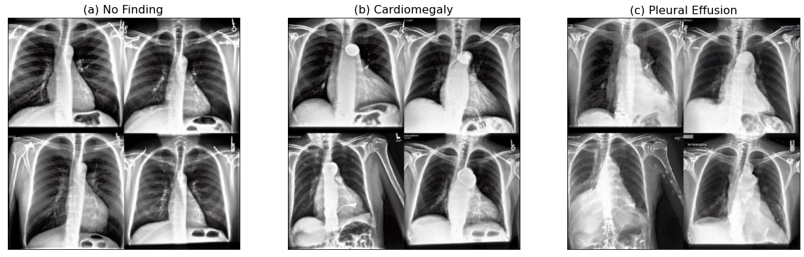

# Medical Stable Diffusion

In this project, we aim to using the latest published **Stable Diffusion** to generate medical images, for example when we enter a prompt with disease, the medical image with that specific disease will be generated automatically.

## Stable Diffusion

Stable diffusion was the most popular open-source AI generating program in 2022. The basic idea behind using stable diffusion for image generation is to model an image as a random process that evolves over time. The process starts with a noisy image and the stable diffusion equation is used to evolve the image over time by adding noise to it. The stable diffusion equation used in image generation is a partial differential equation that describes how the image evolves over time. This equation incorporates a fractional Laplacian operator, which allows for long-range dependence in the image. The fractional Laplacian operator is a generalization of the standard Laplacian operator, which is used in traditional diffusion processes.

As the image evolves over time, it gradually becomes less noisy and more coherent. By controlling the parameters of the stable diffusion equation, we can control the rate of diffusion and the amount of noise added at each step, allowing us to generate a wide variety of images with different textures and structures. Stable diffusion-based image generation has shown promising results in generating naturalistic and diverse images, and has potential applications in computer vision, graphics, and art. 

## Dataset

We chose **CheXpert** to keep training the stable diffusion. It is a large dataset of chest X-rays and competition for automated chest x-ray interpretation, which features uncertainty labels and radiologist-labeled reference standard evaluation sets. Chest radiography is the most common imaging examination globally, critical for screening, diagnosis and management of many life threatening diseases. The dataset included 14 different kind of diseases in the label, with 1 and 0 in a csv file, which makes the prompt setting for the future training much easier.

## First Try with Normal Stable Diffusion

The first try with stable diffusion was end up with terrible results. It was a model pretrained with usual daily life images, so when I want to let it learn some new medical images, it doesn't work so good. What it can only do is to try to find a best token to describe my medical images. So the output images even look colorful. 

<p align="center">
  
</p>
  
## Dreambooth

The DreamBooth was developed by the Facebook, it was based on the Stable Diffusion but made some small differences. The normal stable diffusion searches for the optimal embeddings that can represent concept, hence, is limited by the expressiveness of the textual modality and constrained to the original output domain of the model. In contrast, DreamBooth fine-tune the model in order to embed the subject within the output domain of the model, enabling the generation of novel images of the subject while preserving key visual features that form its identity.

Here is the main difference inside the code with the normal stable diffusion:

```python:
# Stable Diffusion
# Move vae and Unet to device
vae.to(accelerator.device)
unet.to(accelerator.device)

# Keep vae and Unet in eval model as we don't train these
vae.eval()
unet.eval()
-------------------------
for epoch in range(num_train_epochs):
    text_encoder.train()
    ...
```

```python:
# DreamBooth
# Move text_encoder and vae to gpu
text_encoder.to(accelerator.device)
vae.to(accelerator.device)
-------------------------
for epoch in range(num_train_epochs):
    unet.train()
    ...
```
<p align="center">
  
</p>
  
## Framework of Survival

The whole framework of the survival prediction task looks like that:

<p align="center">
  
</p>
  
## Results

We tried different threshold of the filter. It was clear that the threshold $>|0.10|$ showed the best result ($0.621$) among all of them. After filtering, the features of each case were reduced from 126 to 28 which also sped up the computation. The accuracy was far higher than another two related paper also extracted radiomic features in BraTS 2020.


|**Different Thresholds**|**Accuracy**|**MSE**|**SpearmanR**|
| --- | --- | --- | --- |
|without|0.379|$1.079\times10^{10}$|0.335|
|$>\|0.08\|$|0.586|$2.056\times10^8$|0.518|
|$>\|0.10\|$|**0.621**|$3.641\times10^7$|0.502|
|$>\|0.12\|$|0.517|$5.775\times10^7$|0.417|
|$<-0.01$|0.552|$5.167\times10^7$|0.480|
|$<-0.05$|0.379|$1.516\times10^8$|0.050|
|$<-0.10$|0.586|$1.406\times10^5$|0.537|

We also tried to use different input of the images since there were 4 types of images in the training dataset. It was also shown that the input of $T_1$ image had better result of accuracy compared with other images.

|**Different Input Modalities**|**Accuracy**|**MSE**|**SpearmanR**|
| --- | --- | --- | --- |
|$T_1$|**0.621**|$3.641\times10^7$|0.502|
|$T_{1ce}$|0.448|$2.977\times10^8$|0.433|
|$T_2$|0.483|$1.118\times10^5$|0.233|
|$T_{2Flair}$|0.345|$2.470\times10^5$|0.127|
|Combination of 4 modalities|0.517|$7.183\times10^6$|0.494|


## Conclusion

In the survival part, we achieved a promising accuracy ($0.621$). It was clear that the filter depended on the Spearman's Rank had an outstanding performance. The framework without the filter could only reach the accuracy of $0.379$ which was far lower. The reason why we always kept the negative part in the threshold was that the most import feature was age which showed $-0.419$ SpearmanR value with the survival days. And also due to some obvious common sense, such as tumor size and tumor surface area were all negatively correlated with survival time. According to the result, the accuracy with threshold $>|0.10|$ ($0.621$) was higher than the accuracy with threshold only $<-0.10$ ($0.586$), because some of features were also positively correlated with survival time like the tumor's distance and offset from the brain center. Setting the threshold is very important for a good result. It also needs researchers to have relevant medical knowledge of tumors and as we learn more medically about tumors, perhaps we can manually add more important parameters.
