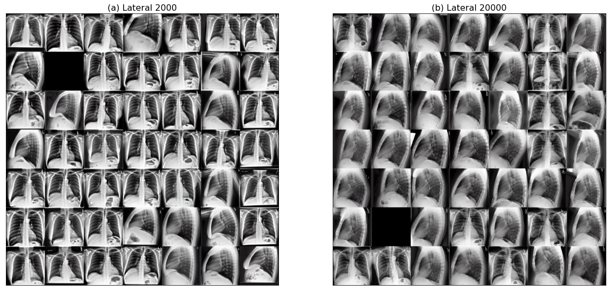

# Medical Stable Diffusion

In this project, we aim to using the latest published **Stable Diffusion** to generate medical images, for example when we enter a prompt with disease, the medical image with that specific disease will be generated automatically.

## Stable Diffusion

Stable diffusion was the most popular open-source AI generating program in 2022. The basic idea behind using stable diffusion for image generation is to model an image as a random process that evolves over time. The process starts with a noisy image and the stable diffusion equation is used to evolve the image over time by adding noise to it. The stable diffusion equation used in image generation is a partial differential equation that describes how the image evolves over time. This equation incorporates a fractional Laplacian operator, which allows for long-range dependence in the image. The fractional Laplacian operator is a generalization of the standard Laplacian operator, which is used in traditional diffusion processes.

As the image evolves over time, it gradually becomes less noisy and more coherent. By controlling the parameters of the stable diffusion equation, we can control the rate of diffusion and the amount of noise added at each step, allowing us to generate a wide variety of images with different textures and structures. Stable diffusion-based image generation has shown promising results in generating naturalistic and diverse images, and has potential applications in computer vision, graphics, and art. 

## Dataset

We chose **CheXpert** to keep training the stable diffusion. It is a large dataset of chest X-rays and competition for automated chest x-ray interpretation, which features uncertainty labels and radiologist-labeled reference standard evaluation sets. Chest radiography is the most common imaging examination globally, critical for screening, diagnosis and management of many life threatening diseases. The dataset included 14 different kind of diseases in the label, with 1 and 0 in a csv file, which makes the prompt setting for the future training much easier.

## First Try with Normal Stable Diffusion

The first try with stable diffusion was end up with terrible results. It was a model pretrained with usual daily life images, so when I want to let it learn some new medical images, it doesn't work so good. What it can only do is to try to find a best token to describe my medical images. So the output images even look colorful. 

<p align="center">
  
</p>
  
## Dreambooth

The DreamBooth was developed by the Facebook, it was based on the Stable Diffusion but made some small differences. The normal stable diffusion searches for the optimal embeddings that can represent concept, hence, is limited by the expressiveness of the textual modality and constrained to the original output domain of the model. In contrast, DreamBooth fine-tune the model in order to embed the subject within the output domain of the model, enabling the generation of novel images of the subject while preserving key visual features that form its identity.

## Main Differences between Stable Diffusion and DreamBooth inside the Code

```python:
# Stable Diffusion
# Move vae and Unet to device
vae.to(accelerator.device)
unet.to(accelerator.device)

# Keep vae and Unet in eval model as we don't train these
vae.eval()
unet.eval()
-------------------------
for epoch in range(num_train_epochs):
    text_encoder.train()
    ...
```

```python:
# DreamBooth
# Move text_encoder and vae to gpu
text_encoder.to(accelerator.device)
vae.to(accelerator.device)
-------------------------
for epoch in range(num_train_epochs):
    unet.train()
    ...
```

## Results of DreamBooth

These are different diseases output with 2000 iterations training:

<p align="center">
  
</p>

There are some lateral images mixed inside the dataset, if the model can tell the difference between lateral images and frontal images, then of course it has the ability to tell the difference from different diseases. And I find that the more iterations for training, the better result we will get. I do a comparison between **2000 iterations** and **20000 iterations** here:

<p align="center">
  
</p>

Also I tried the DreamBooth on the eye dataset as well, to tell the difference between **RG** and **NRG**, it also shows some promising result:

<p align="center">
  
</p>

## The comparison between AUC Results in Chest Dataset

I used the Res-Net to train the classification. The accuracy of generated images were all higher compared with the original-images but the mean AUC was 10 percent lower. Only the disease Edema's AUC was higher. I tried different guidance scale, different training iterations and also replace the Cardiomegaly images in the generated images with the separated training one. Separate training and the changing of guidance scale didn't have some help. 

Regenerated images do lose some details which will lower the performance in computer vision training.

|**AUC (Best)**|**Cardiomegaly**|**Edema**|**Consolidation**|**Atelectasis**|**Pleural Effusion**|
| --- | --- | --- | --- | --- | --- |
|Original images|0.737|0.8449|0.8021|0.7603|0.7967|
|50000 iterations|0.6215|0.8754|0.5716|0.405(Lowest)|0.7435|
|20000 iterations|0.6167|0.88|0.2762(Lowest)|0.2849(Lowest)|0.8169|
